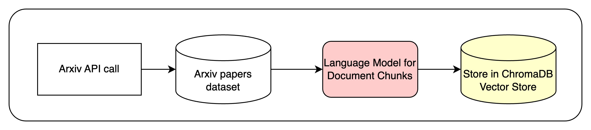

Pipeline 1 - Retrieve ArXiv Data and Build Vector Store for RAG
===============================================================

This document outlines the process of building an arXiv database and constructing a Retrieval-Augmented Generation (RAG) vector store for efficient paper searching.

RAG Vector Store Construction
-----------------------------

The RAG vector store is built using the ``rag.py`` script, which processes the CSV file created by ``retrieve_papers_with_link.py``. The construction process involves:

1. **Data Loading**:
    - Reads the CSV file into a pandas DataFrame.

    - Creates a 'combined' column by concatenating the 'Title' and 'Summary' fields.

File Structure
--------------

Below is the tree structure for files relevant to this section:

.. code-block:: text

        project_root/
        ├── conf/
        │   └── config.yaml
        ├── src/
        │   ├── retrieve_papers_with_link.py
        │   └── rag.py
        ├── arxiv/
        │   └── arxiv_papers_2022_2024_with_links_final.csv
        └── vector_store/
            └── (contents of vector store)

    - `conf/config.yaml`: Configuration file for the project.
    - `src/retrieve_papers_with_link.py`: Script for retrieving arXiv papers.
    - `src/rag.py`: Script for the Retrieval-Augmented Generation (RAG) pipeline.
    - `arxiv/arxiv_papers_2022_2024_with_links_final.csv`: CSV file containing the arXiv paper data.
    - `vector_store/`: Directory containing the vector store data.

ArXiv Database Construction
---------------------------

The arXiv database is built using the ``retrieve_papers_with_link.py`` script. This script performs the following steps:

1. **Data Retrieval**: 
    - Uses the OAI-PMH (Open Archives Initiative Protocol for Metadata Harvesting) to fetch arXiv papers.
    
    - Retrieves papers from the Computer Science category within a specified date range.

2. **Data Extraction**:
    - Parses the XML response to extract relevant information for each paper:

        - Title

        - Summary

        - Updated date

        - Category

        - Link to the paper

3. **Data Storage**:
    - Saves the extracted data to a CSV file.

    - Performs incremental saves every 100 records to prevent data loss.

4. **Error Handling and Retries**:
    - Implements retry logic for network requests to handle temporary failures.

    - Logs errors and information for monitoring the retrieval process.

5. **Configurable Parameters using `config.yaml`**:

    - Uses Hydra for configuration management, allowing easy adjustment of parameters such as date range and maximum results.

    - Open the `conf/config.yaml` file to adjust the parameters for retrieving arXiv papers.
    
    - **`start_date`**: Set the starting date using `date_range.from_date` for the paper retrieval (format: YYYY-MM-DD).
    
    - **`until_date`**: Set the ending date using `date_range.until_date` for the paper retrieval (format: YYYY-MM-DD).
    
    - **`max_results`**: Specify the maximum number of papers to retrieve using `max_results` (default is 200,000).
    
    - **`output_file`**: Define the path where the retrieved papers will be saved as a CSV file using `output_file`.

The resulting CSV file serves as the foundation for the RAG vector store.

RAG Vector Store Construction
-----------------------------

The RAG vector store is built using the ``rag.py`` script, which processes the CSV file created by ``retrieve_papers_with_link.py``. The construction process involves:

1. **Data Loading**:
    - Reads the CSV file into a pandas DataFrame.

    - Creates a 'combined' column by concatenating the 'Title' and 'Summary' fields.

2. **Model Initialization**:
    - Loads a pre-trained language model and tokenizer for generating embeddings.

3. **Vector Store Initialization**:
    - Sets up a Chroma vector store with persistence for storing embeddings.

4. **Document Embedding**:
    - Processes the 'combined' text for each paper in batches.

    - Generates embeddings using the pre-trained model.

5. **Vector Store Population**:
    - Stores the embeddings along with metadata (Title, Summary, Updated date, Category, Link) in the Chroma vector store.

6. **Persistence**:
    - Saves the vector store to disk for future use.

7. **Consistency Checking**:
    - Implements a function to verify that the number of items in the vector store matches the number of items in the DataFrame.
    
    - Re-creates the vector store if inconsistencies are detected.

Search Functionality
--------------------

The RAG system provides three types of search:

1. **Vector Search**: 
    - Uses cosine similarity to find the most relevant papers based on embedding similarity.

2. **Keyword Search**: 
    - Performs a simple text-based search on the 'combined' column of the DataFrame.

3. **Hybrid Search**: 
    - Combines results from both vector and keyword searches for improved accuracy.

Usage
-----

To use the RAG system:

1. Run ``retrieve_papers_with_link.py`` to build the initial CSV database.

2. Run ``rag.py`` to construct the vector store and enable search functionality.

3. Use the ``hybrid_search`` function to perform searches on the arXiv papers.

4. **Configuring `config.yaml`**:

    - Open the `conf/config.yaml` file to adjust the parameters for retrieving arXiv papers.
    
    - **`output_file`**: Define the path where the retrieved papers will be saved as a CSV file using `output_file`.

    - **`embedding_model.name`**: Specify the name of the pre-trained model to be used for generating embeddings (e.g., `"sentence-transformers/all-MiniLM-L6-v2"`).
    
    - **`vector_store.persist_directory`**: Set the directory path where the vector store will be persisted (e.g., `"./vector_store"`).
    
    - **`search.top_n`**: Define the number of top results to return for search queries (default is `15`).
    
    - **`summary.word_limit`**: Set the maximum number of words for the summary truncation (default is `30`).

The system allows for efficient retrieval of relevant research papers based on user queries, combining the power of semantic search with traditional keyword matching.