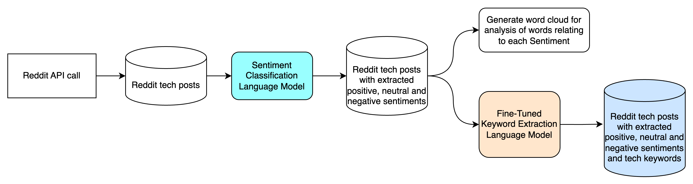

Retrieve Reddit Posts and Extract Sentiments and Keywords
=========================================================

This document provides step-by-step instructions on how to run the pipeline defined in `infer_pipeline.py`. The pipeline consists of three main scripts: `scrape_reddit.py`, `sentiment_analysis.py`, and `extract_reddit_keywords_with_bart.py`. Each script performs a specific function in the data processing workflow.

Pipeline Overview
-----------------

Prerequisites
-------------
**Reddit API Credentials**: You need to create a Reddit application to obtain the following credentials:
   - CLIENT_ID
   - SECRET_KEY
   - REDDIT_GRANT_TYPE
   - REDDIT_USERNAME
   - REDDIT_PASSWORD

   Store these credentials in a `.env` file in the same directory as your scripts.

Configuration File
------------------
The configuration for the pipeline is stored in `conf/config.yaml`. You need to prepare this file before running the pipeline. Below are the key sections you need to configure:

1. **PRAW Configuration**:
   - `praw_output`: The name of the output CSV file for scraped Reddit data.
   - `subreddits`: A list of subreddit names to scrape.

   Example:

.. code-block:: text

    praw:
    praw_output: praw_output.csv
    subreddits:
        - datascience
        - MachineLearning
        - ChatGPT
        - CharacterAI
        - cybersecurity

2. **Sentiment Analysis Configuration**:
   - `input_file`: The input CSV file generated from the scraping step.
   - `output_file`: The name of the output CSV file for sentiment analysis results.
   - `model_name`: The model to be used for sentiment analysis.

   Example:

.. code-block:: text

   sentiment:
     input_file: praw_output.csv
     output_file: sentiment_analysis_output.csv
     model_name: distilbert-base-uncased-finetuned-sst-2-english

3. **Keyword Extraction Configuration**:
   - `reddit_dataset`: The input file for keyword extraction (output from sentiment analysis).
   - `reddit_results_file`: The output file for extracted keywords.

   Example:

.. code-block:: text

   extract:
     reddit_dataset: sentiment_analysis_output.csv
     reddit_results_file: reddit_keywords.csv

Running the Pipeline
--------------------
To run the entire pipeline, execute the following command in your terminal:

.. code-block:: bash

    python -m src.infer_pipeline

This command will sequentially run the following scripts:

1. **Scrape Reddit Data** (`scrape_reddit.py`):

   - **Function**: Scrapes posts and comments from specified subreddits.

   - **Output**: A CSV file containing the scraped data (as specified in `praw_output`).

2. **Sentiment Analysis** (`sentiment_analysis.py`):

   - **Function**: Analyzes the sentiment of the comments scraped from Reddit.

   - **Output**: A CSV file containing sentiment analysis results (as specified in `output_file`).

3. **Keyword Extraction** (`extract_reddit_keywords_with_bart.py`):

   - **Function**: Extracts keywords from the sentiment analysis results using the BART model.

   - **Output**: A CSV file containing the extracted keywords (as specified in `reddit_results_file`).

Expected Outputs
----------------

- **Scraped Data**: `praw_output.csv` - Contains the scraped Reddit posts and comments.

- **Sentiment Analysis Results**: `sentiment_analysis_output.csv` - Contains sentiment scores and labels for each comment.

- **Extracted Keywords**: `reddit_keywords.csv` - Contains keywords extracted from the sentiment analysis results.

Conclusion
----------

By following these instructions, you should be able to successfully run the pipeline and obtain the desired outputs. Ensure that all configurations are correctly set in `config.yaml` and that you have the necessary credentials and libraries installed.