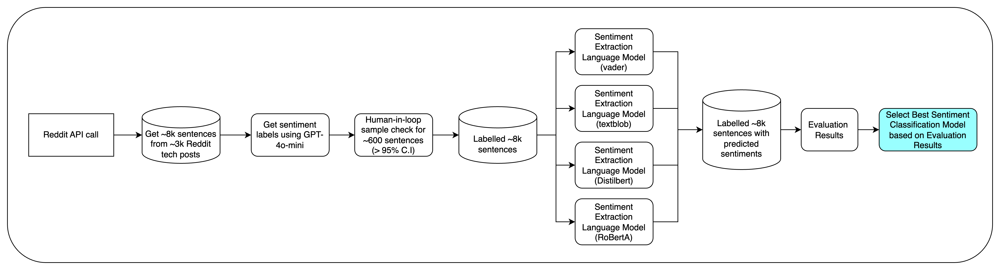
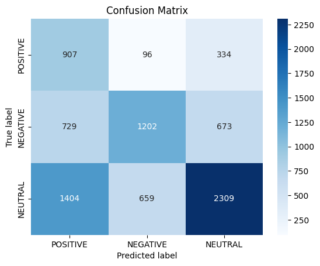
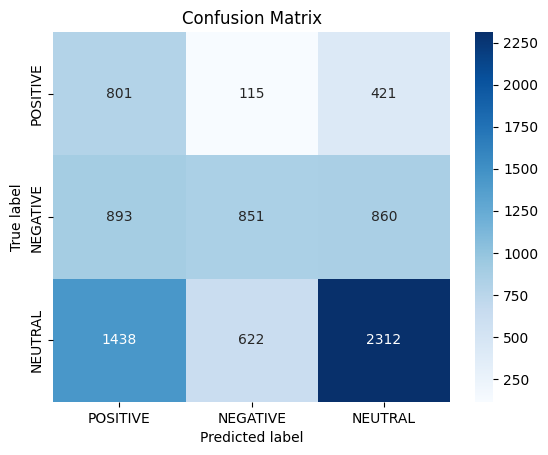
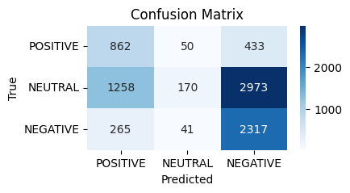
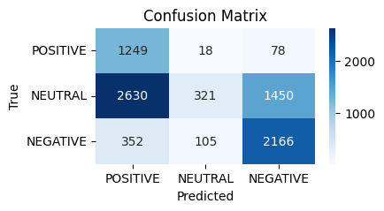
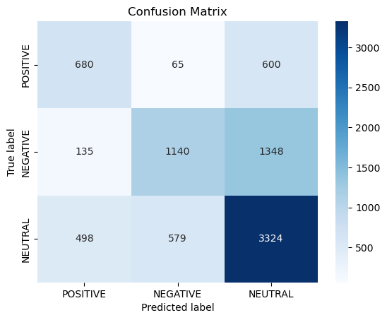
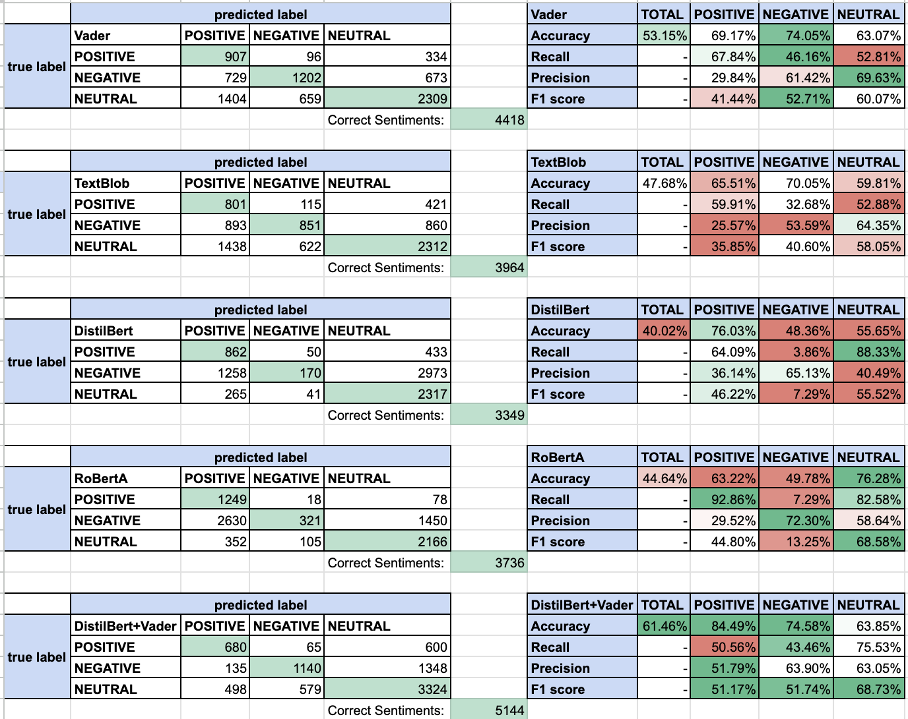

Select Sentiment Extraction Model + Evaluate Model
==================================================

**Introduction**
------------------

This section documents the steps taken by the team to select a model to do sentiment extraction from Reddit posts. The team began by comparing four prominent sentiment analysis models: VADER, TextBlob, DistilBERT, and RoBERTa. These models were chosen due to their varying methodologies and performance characteristics in sentiment extraction tasks. VADER and TextBlob are rule-based models known for their simplicity and efficiency, making them suitable for real-time applications. In contrast, DistilBERT and RoBERTa are transformer-based models that leverage deep learning techniques, offering potentially higher accuracy at the cost of increased computational complexity. This comparison aims to identify the most effective model for our sentiment extraction needs based on empirical performance metrics.

Flowchart on Sentiment Model Selection
~~~~~~~~~~~~~~~~~~~~~~~~~~~~~~~~~~~~~~~

Reference Notebooks 
~~~~~~~~~~~~~~~~~~~

Refer to the below notebooks for more information:

1. **VADER Analysis**:

   - Notebook: `notebooks/sentiment_analysis_vader_sentlevel.ipynb`
   
   - Description: Detailed analysis of the VADER model, including implementation and evaluation metrics.

2. **TextBlob Analysis**:

   - Notebook: `notebooks/sentiment_analysis_textblob_sentlevel.ipynb`
   
   - Description: Comprehensive review of the TextBlob model, showcasing its performance and use cases.

3. **DistilBERT Analysis**:

   - Notebook: `notebooks/Sentiment_Analysis_Scoring_Distilbert.ipynb`
   
   - Description: In-depth exploration of the DistilBERT model, focusing on its architecture and evaluation results.

4. **RoBERTa Analysis**:

   - Notebook: `notebooks/Sentiment_Analysis_Scoring_Roberta.ipynb`
   
   - Description: Examination of the RoBERTa model, highlighting its strengths and weaknesses in sentiment extraction.

5. **Combined Model Approach**:

   - Notebook: `notebooks/Sentiment_Analysis_Scoring_Distilbert+Vader.ipynb`
   
   - Description: Analysis of the combined VADER and DistilBERT approach, including methodology and performance metrics.

**Model Selection Methodology**
---------------------------------

The model selection process involves the following steps:

    1. **Data Collection**:

    - As there is no ready available Reddit tech post datasets with sentiments publicly available, the team performed a Reddit API call to gather approximately 8,000 sentences from around 3,000 Reddit tech posts.

    2. **Sentiment Labeling**:

    - Use GPT-4o-mini to generate sentiment labels for the collected sentences.

    3. **Quality Assurance**:

    - Conduct a human-in-loop sample check for about 600 sentences to check that the sentiments identified by GPT-4o-mini is correct. This ensures a confidence level greater than 95%.

    4. **Model Evaluation**:

    - Apply the sentiment extraction models (VADER, TextBlob, DistilBERT, and RoBERTa) to the labeled sentences to predict sentiments.

    5. **Evaluation Results**:

    - Compile the evaluation results from each model by comparing the results to the label.

    6. **Model Selection**:

    - Select the best sentiment classification model based on the evaluation results.

**Model Evaluation Criteria**
------------------------------

   - **Confusion Matrix**: Analyze the confusion matrix for each model to understand the distribution of true positives, false positives, true negatives, and false negatives.
   
   - **Accuracy**: Calculate the accuracy for each model, which is the ratio of correctly predicted instances to the total instances.
   
   - **Recall**: Evaluate recall for each class (POSITIVE, NEGATIVE, NEUTRAL) to understand how well the model identifies each sentiment.
   
   - **Precision**: Calculate precision for each class, which measures the ratio of correctly predicted positive observations to the total predicted positives. This helps assess the model's ability to avoid false positives.

   - **F1 Score**: Calculate the F1 score for each class to balance precision and recall, especially in cases of class imbalance.

The main criteria for this assessment is **Accuracy** which gives a straightforward measure of overall performance, indicating how many predictions were correct out of all predictions made. It is especially useful when the classes are balanced.
**F1 Score** is the other important criteria in sentiment analysis because it accounts for both false positives and false negatives, providing a more nuanced view of model performance. In scenarios where one sentiment class may be more prevalent than others (e.g., more neutral comments), relying solely on accuracy can be misleading. The F1 score helps ensure that the model performs well across all classes, making it a critical metric for applications where identifying all sentiment types accurately is essential.

**Model Comparison**
--------------------
   
   - Compare the confusion matrices from each model:
     
     - **VADER**: Check how well it performs in identifying sentiments compared to TextBlob and transformer-based models.
     
     - **TextBlob**: Evaluate its performance against VADER and transformer models.
     
     - **DistilBERT and RoBERTa**: Analyze their performance, as they are expected to perform better due to their deep learning architecture.
   
   - Look for patterns in the confusion matrices, such as which model consistently misclassifies certain sentiments.

**Performance Metrics**
-----------------------
   
   - Summarize the performance metrics for each model:
     
     - **Accuracy**: Higher accuracy indicates better overall performance.
     
     - **Recall**: Higher recall for each class indicates better identification of that sentiment.
     
     - **Precision**: Higher precision for each class indicates a lower rate of false positives, reflecting the model's ability to correctly identify positive instances.

     - **F1 Score**: A higher F1 score indicates a better balance between precision and recall.

As mentioned in Model Evaluation Criteria, the performance criteria of interest here is **Accuracy** and **F1 Score**.

**Final Decision**
------------------
   
   - Based on the summarized metrics, select the model that:
     
     - Achieves the highest accuracy.
          
     - Has the highest F1 score, indicating a good balance between precision and recall.
   
   - Consider the complexity and computational efficiency of the models. Simpler models like VADER and TextBlob may be preferred for real-time applications, while transformer models may be used for batch processing where accuracy is paramount.

**Implementation**
------------------
   
   - Once the final model is selected, implement it in the sentiment extraction pipeline.
   
   - Monitor its performance in real-world scenarios and be prepared to retrain or fine-tune the model as necessary based on new data.

Key Results
-----------

**VADER**:
~~~~~~~~~~~~

- Confusion Matrix using VADER:

- Evaluation Results:

.. table:: Results for VADER
   :width: 100%

   +---------+--------+----------+----------+---------+
   | Vader   | TOTAL  | POSITIVE | NEGATIVE | NEUTRAL |
   +---------+--------+----------+----------+---------+
   | Accuracy| 53.15% | 69.17%   | 74.05%   | 63.07%  |
   +---------+--------+----------+----------+---------+
   | Recall  |        | 67.84%   | 46.16%   | 52.81%  |
   +---------+--------+----------+----------+---------+
   |Precision|        |  9.84%   | 61.42%   | 69.63%  |
   +---------+--------+----------+----------+---------+
   | F1 score|        | 41.44%   | 52.71%   | 60.07%  |
   +---------+--------+----------+----------+---------+

**TextBlob**:
~~~~~~~~~~~~~~~~

- Confusion Matrix:

- Evaluation Results:

.. table:: Results for TextBlob
   :width: 100%

   +---------+--------+----------+----------+---------+
   | TextBlob| TOTAL  | POSITIVE | NEGATIVE | NEUTRAL |
   +---------+--------+----------+----------+---------+
   | Accuracy| 47.68% | 65.51%   | 70.05%   | 59.81%  |
   +---------+--------+----------+----------+---------+
   | Recall  |        | 59.91%   | 32.68%   | 52.88%  |
   +---------+--------+----------+----------+---------+
   |Precision|        | 25.57%   | 53.59%   | 64.35%  |
   +---------+--------+----------+----------+---------+
   | F1 score|        | 35.85%   | 40.60%   | 58.05%  |
   +---------+--------+----------+----------+---------+

**DistilBERT**:
~~~~~~~~~~~~~~~~~

- Confusion Matrix:

- Evaluation Results:

.. table:: Results for DistilBERT
   :width: 100%

   +-----------+--------+----------+----------+---------+
   | DistilBERT| TOTAL  | POSITIVE | NEGATIVE | NEUTRAL |
   +-----------+--------+----------+----------+---------+
   | Accuracy  | 40.02% | 76.03%   | 48.36%   | 55.65%  |
   +-----------+--------+----------+----------+---------+
   | Recall    |        | 64.09%   | 3.86%    | 88.33%  |
   +-----------+--------+----------+----------+---------+
   | Precision |        | 36.14%   | 65.13%   | 40.49%  |
   +-----------+--------+----------+----------+---------+
   | F1 score  |        | 46.22%   | 7.29%    | 55.52%  |
   +-----------+--------+----------+----------+---------+

**RoBERTa**:
~~~~~~~~~~~~~~

- Confusion Matrix:

- Evaluation Results:

.. table:: Results for RoBERTa
   :width: 100%

   +---------+--------+----------+----------+---------+
   | RoBERTa | TOTAL  | POSITIVE | NEGATIVE | NEUTRAL |
   +---------+--------+----------+----------+---------+
   | Accuracy| 44.64% | 63.22%   | 49.78%   | 76.28%  |
   +---------+--------+----------+----------+---------+
   | Recall  |        | 92.86%   | 7.29%    | 82.58%  |
   +---------+--------+----------+----------+---------+
   |Precision|        | 29.52%   | 72.30%   | 58.64%  |
   +---------+--------+----------+----------+---------+
   | F1 score|        | 44.80%   | 13.25%   | 68.58%  |
   +---------+--------+----------+----------+---------+

**Combined Method: VADER + DistilBERT**:
~~~~~~~~~~~~~~~~~~~~~~~~~~~~~~~~~~~~~~~~~~

- Given that VADER has the best overall accuracy while DistilBERT excels in positive class metrics, we propose a combined approach:
     
     - **Step 1**: Use VADER and DistilBert to perform initial sentiment classification separately.
     
     - **Step 2**: For instances classified as the same class by both models, the predicted class will be used. Prediction that are different between the 2 models are defaulted to 'Neutral' class.
     
     - **Step 3**: Aggregate the results from both models to enhance the overall sentiment extraction process, focusing on improving the identification of positive sentiments for course design.

- This method leverages the strengths of both models, ensuring that we maintain high accuracy while also capturing the nuances of positive sentiment effectively.

- Confusion Matrix:

- Evaluation Results:

.. table:: Results for DistilBERT + VADER
   :width: 100%

   +------------------+--------+----------+----------+---------+
   | DistilBert+Vader | TOTAL  | POSITIVE | NEGATIVE | NEUTRAL |
   +------------------+--------+----------+----------+---------+
   | Accuracy         | 61.46% | 84.49%   | 74.58%   | 63.85%  |
   +------------------+--------+----------+----------+---------+
   | Recall           |        | 50.56%   | 43.46%   | 75.53%  |
   +------------------+--------+----------+----------+---------+
   | Precision        |        | 51.79%   | 63.90%   | 63.05%  |
   +------------------+--------+----------+----------+---------+
   | F1 score         |        | 51.17%   | 51.74%   | 68.73%  |
   +------------------+--------+----------+----------+---------+

Summary / Conclusion
--------------------

In summary, the best model to extract sentiments from the reddit post is a combination of Vader + DistilBert. This combination has the best accuracy and F1 scores among the various other models across positive, negative and neutral classes.
By following this methodology, the team has systematically evaluate and select the most effective sentiment extraction model based on empirical performance metrics derived from the confusion matrices and other evaluation criteria.