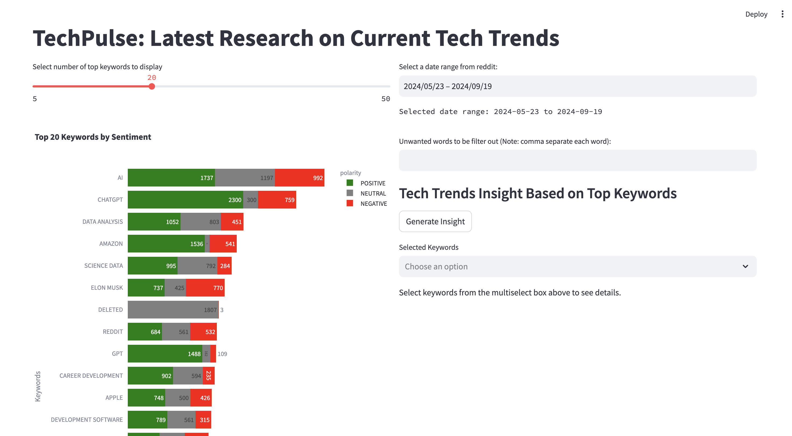

TechPulse User Interface
===================================

Introduction
------------

The TechPulse App is an application that allows users to analyze Reddit tech posts and find related arXiv research papers. This document provides a guide on how to use the application effectively.

Usage
-----

To launch the application, run the following command in your terminal:

.. code-block:: bash

    streamlit run src/streamlit_poc_with_gemma.py

Once the application is running, you will see the Streamlit UI in your web browser that looks like this:

**Main UI Display**:

The main features include:

1. **Date Range Selection**: Choose a date range to filter Reddit posts. By default, the maximum range will be selected.

   .. image:: source/_static/screenshot_date_range.png
      :alt: Date Range Selection

2. **Top Keywords Display**: View the top keywords based on reddit post dates and sentiment analysis. You can select the number of top keywords to be displayed within the range of 5 to 50. You can also select the relevant sentiments by clicking on the 'POSITIVE', 'NEUTRAL' and 'NEGATIVE' sentiment to select or unselect them.

   .. image:: source/_static/screenshot_top_keywords.png
      :alt: Top Keywords Display

3. **Keyword Filtering**: If there are specific unwanted words that you prefer not to be included, input these unwanted words to filter out from the analysis.

   .. image:: source/_static/screenshot_keyword_filter.png
      :alt: Keyword Filtering

4. **Tech Trends Insight**: Generate insights based on the selected keywords. This is generated by the Google/Gemma-2b model. The model can be replaced by a more performant model as required.

   .. image:: source/_static/screenshot_insight.png
      :alt: Tech Trends Insight

5. **Research Paper Details**: View related top 10 research papers for selected keywords. The list is sorted with the latest updated papers on top.

   .. image:: source/_static/screenshot_research_papers.png
      :alt: Research Paper Details

Conclusion
----------

This application serves as a useful tool for users to analyze tech trends and finding relevant research materials. For any issues or contributions, please refer to the project's repository.